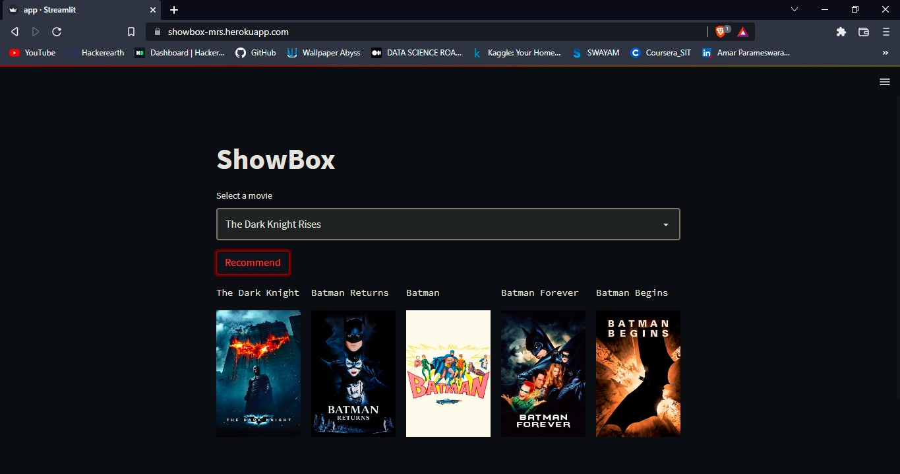

## Movie Recommender System - ShowBox

***

***

[Kaggle Dataset - The Movie DataBase (TMDB) 5000](https://www.kaggle.com/datasets/tmdb/tmdb-movie-metadata)

***

### *STEPS PERFORMED:*

* Load the data from the Kaggle dataset
* Data Cleaning - removing the rows with missing data
* Data Pre-processing - simplifying the dataframe for the analysis
* Removing spaces and creating tags for each movie
* Applying Stemming to the tags
* Count Vectorization - creating a matrix of the tags
* Applying Cosine Similarity to find the most similar movies

* Built a Streamlit app to for the user to interact with the system
* Deployed the app on Heroku

***

ShowBox App - https://showbox-mrs.herokuapp.com/

***

***
